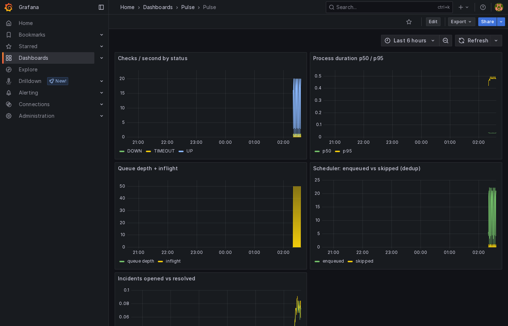

# Pulse — API Monitoring & Incident Platform

> Ekosistem: [api](https://github.com/RakhaYandra/pulse) · [web](https://github.com/RakhaYandra/pulse-web)

Go, Gin, PostgreSQL, Redis, Docker. Full Clean Architecture.

Self-hosted platform that health-checks APIs on a schedule, stores results,
opens incidents on configurable failure thresholds, resolves on recovery, and
notifies via Telegram. Monitoring runs in background workers — never in the
dashboard request lifecycle.

## Quickstart

```bash
cp .env.example .env   # fill TELEGRAM_* to enable notifications (optional)
docker compose up -d --build
curl localhost:8080/health
# dashboard: https://github.com/RakhaYandra/pulse-web
```

Demo login: `demo@pulse.local / demo1234` (register your own for isolation).

## Verification (all green)

| Check | Result |
|---|---|
| Engine E2E (real) | 404-monitor → OPEN after 2 fails → RESOLVED after recovery, dashboard correct |
| Newman | 20/20 (`qa/collection.json`) |
| Go unit | domain + usecase (fake repos) + checker |
| Playwright e2e | 5/5 (`pulse-web/e2e`, black-box) |
| Avg API latency (Newman) | ~10ms local |

## Benchmark (measured, `docs/BENCHMARK.md`)

Deterministic stub (70% ok / 15% slow / 10% flaky / 5% timeout), 60s interval,
16 CPU / 14 GB. Post-hardening (dedup + worker pool + 10s tick):

| Monitors | Workers | checks/s | peak burst | queue max | overdue | false incidents | timeouts detected |
|---|---|---|---|---|---|---|---|
| 100 | 2 | 1.29 | 3.4/s | 0 | 0 | 0 | 5/5 |
| 500 | 2 | 6.20 | ~7/s | 0 | 0 | 0 | 25/25 |
| 1000 | 4 | 9.28 | 28/s | 0 | 0 | 0 | 50/50 |

Honest note: peak drain exceeds required rate at every scale, but wave
phasing stretches effective cadence ~25-44% (synchronized seeding + drain
spread + tick quantization). Queue stays bounded; incident behavior exact.

## Observability

Per-process `/metrics` (api :9101, workers :9102-04/06, scheduler :9105),
Prometheus + Grafana + 2 alerts via `docker-compose.observability.yml`:

```bash
docker compose -f docker-compose.yml -f docker-compose.observability.yml up -d prometheus grafana
# Grafana http://localhost:3000 (admin/pulse), dashboard "Pulse"
```



## Key engineering points

1. API layer separated from execution via Redis-backed workers.
2. Retry (≤3 attempts) collapses into one check — uptime math stays correct.
3. Incident state machine: fail streak → OPEN, success streak → RESOLVED.
4. Failure isolation: per-job `recover()`, one bad monitor can't kill workers.
5. Queue holds no business state — loss only delays, never corrupts.

## Layout

`backend/` (Go, Clean Architecture: domain/usecase/infrastructure/delivery)
`qa/` (Newman contract) · `docs/` (BRD, PRD, Architecture, ADRs)

## Future

MTTR/SLA reports, self-monitoring, single-VPS deploy, `next_run_at` scheduling.
